# Test Documentation

## Purpose
This document provides comprehensive documentation for all testing methodologies applied to the Movie Review Backend project. It demonstrates the use of multiple testing approaches including unit testing, integration testing, mocking, equivalence partitioning, fault injection, and exception handling across various pull requests.


## Table of Contents
1. [Testing Methodologies Overview](#testing-methodologies-overview)
2. [Pull Request Documentation](#pull-request-documentation)
3. [Test Coverage Summary](#test-coverage-summary)
4. [Running Tests](#running-tests)

---

## Testing Methodologies Overview

### 1. *Unit Testing with Mocking*
Uses `unittest.mock` to isolate components by mocking external dependencies such as file I/O, database operations, and service layers. This ensures tests run quickly and don't depend on external state.

### 2. *Integration Testing*
Tests complete workflows across multiple components using real file systems (temporary directories) and FastAPI's TestClient for API endpoint testing.

### 3. *Equivalence Partitioning*
Divides input data into valid and invalid partitions, testing representative values from each partition to reduce redundant test cases while maintaining comprehensive coverage.

### 4. *Fault Injection*
Deliberately introduces errors (corrupted data, missing files, expired sessions) to test error handling and system behavior under failure conditions.

### 5. *Exception Handling*
Validates all error paths, including ValueError, HTTPException, and other exceptions, ensuring proper error messages and status codes.

### 6. *Boundary Testing*
Tests edge cases and limits such as empty inputs, maximum lengths, date ranges, and rating boundaries.

### 7. *Security Testing*
Tests password hashing, session security, token generation, and authentication mechanisms.

---

## Pull Request Documentation

### PR #1: Search Service Implementation with Comprehensive Testing
**Branch:** `search_feature`  
**Files Changed:**
- `backend/services/search_service.py` (New)
- `backend/routes/search_routes.py` (New)
- `tests/backend/search/unit/test_search_service_unit.py` (New)
- `tests/backend/search/integration/test_search_integration.py` (New)

**Description:**
Implemented complete search functionality for movies including search by title, genre, date range, and advanced multi-criteria searches. Includes comprehensive unit and integration tests.

---

### 1. Mocking (Unit Tests)
**Purpose:** Isolate search logic from file I/O operations

**Example - `TestLoadMovieMetadata`:**
```python
def test_load_metadata_success(self, search_service, sample_metadata):
    """Test successfully loading metadata from JSON file"""
    mock_file_data = json.dumps(sample_metadata)
    
    with patch('os.path.exists', return_value=True), \
         patch('builtins.open', mock_open(read_data=mock_file_data)):
        
        result = search_service._load_movie_metadata("Avengers Endgame")
        assert result == sample_metadata
```
**Methodology:** Mocks `os.path.exists` and `builtins.open` to avoid actual file operations, ensuring fast, isolated tests.

**Example - `TestSearchByTitle`:**
```python
def test_search_partial_match(self, search_service, sample_metadata):
    with patch.object(search_service, '_get_all_movie_folders', 
                      return_value=["Avengers Endgame", "Joker"]), \
         patch.object(search_service, '_load_movie_metadata', 
                      side_effect=[sample_metadata, sample_metadata_joker]):
        
        results = search_service.search_by_title("Avengers")
        assert len(results) == 1
```
**Methodology:** Mocks folder listing and metadata loading to test search logic independently.

### 2. Equivalence Partitioning
**Applied to:** Search inputs, date ranges, genre filters

**Example - Search by Title:**
- **Partition 1:** Partial matches (query="Avengers" → matches "Avengers Endgame")
- **Partition 2:** Exact matches (query="Joker", exact_match=True)
- **Partition 3:** Case insensitive (query="avengers endgame")
- **Partition 4:** No results (query="Nonexistent Movie")

**Example - Date Range Search:**
- **Partition 1:** Both start and end dates provided
- **Partition 2:** Only start date (open-ended)
- **Partition 3:** Only end date (open-ended)
- **Partition 4:** Invalid date format (raises ValueError)

### 3. Fault Injection
**Purpose:** Test error handling and system resilience

**Example - Missing Files:**
```python
def test_load_metadata_file_not_found(self, search_service):
    """Test loading metadata when file doesn't exist"""
    with patch('os.path.exists', return_value=False):
        result = search_service._load_movie_metadata("NonexistentMovie")
        assert result is None
```
**Injected Fault:** Non-existent file  
**Expected Behavior:** Returns None gracefully, no exception thrown

**Example - Invalid Date Format:**
```python
def test_search_invalid_date_format(self, search_service):
    with pytest.raises(ValueError):
        search_service.search_by_date_range("invalid-date", "2019-12-31")
```
**Injected Fault:** Malformed date string  
**Expected Behavior:** Raises ValueError with clear error message

### 4. Integration Testing
**Purpose:** Test complete workflows with real file operations

**Setup:** Creates temporary database with 4 sample movies (Avengers Endgame, Joker, Inception, The Dark Knight)

**Example - End-to-End Search:**
```python
def test_search_by_genre_integration(self, search_service_with_data):
    """Integration test: Search by genre with real files"""
    results = search_service_with_data.search_by_genre(["Action"])
    
    assert len(results) == 3  # Avengers, Inception, Dark Knight
    titles = [r["title"] for r in results]
    assert "Avengers Endgame" in titles
```
**Methodology:** Uses actual JSON files and CSV parsing, validates complete data flow.

**Example - API Endpoint Testing:**
```python
def test_search_title_endpoint_integration(self, client):
    response = client.get("/api/search/title?q=Avengers")
    
    assert response.status_code == 200
    data = response.json()
    assert data["count"] == 1
    assert data["results"][0]["title"] == "Avengers Endgame"
```
**Methodology:** Tests HTTP request/response cycle with FastAPI TestClient.

### 5. Exception Handling
**Example - API Error Responses:**
```python
def test_invalid_year_endpoint_integration(self, client):
    response = client.get("/api/search/year/3000")
    assert response.status_code == 400

def test_movie_not_found_endpoint_integration(self, client):
    response = client.get("/api/search/movie/Nonexistent%20Movie")
    assert response.status_code == 404
```
**Status Codes Tested:** 200 (Success), 400 (Bad Request), 404 (Not Found)

### Screenshots
- Below is an image of the Mannual Testing in the PR.
 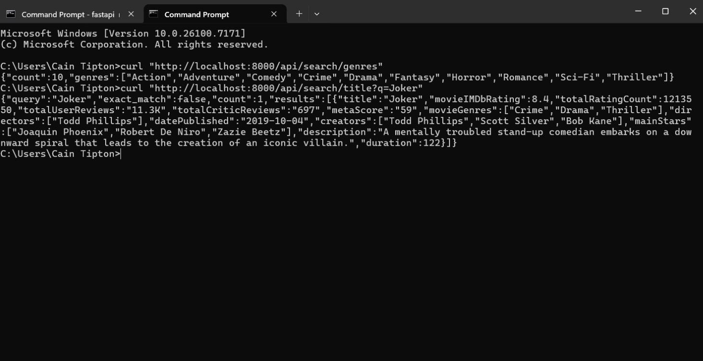
- Below is an image of the Unit Tests succesfully running in the PR
 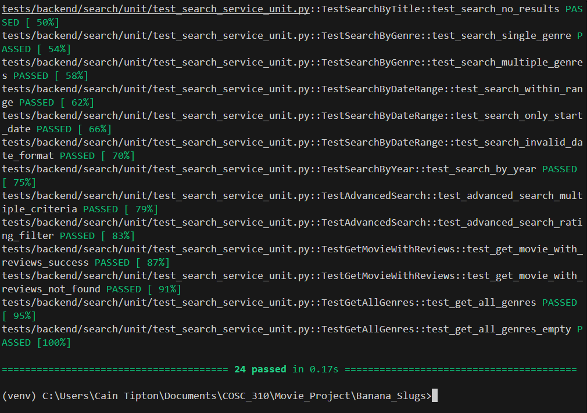
- Below is an image of the Intergration tests succesfulling running in the PR 
 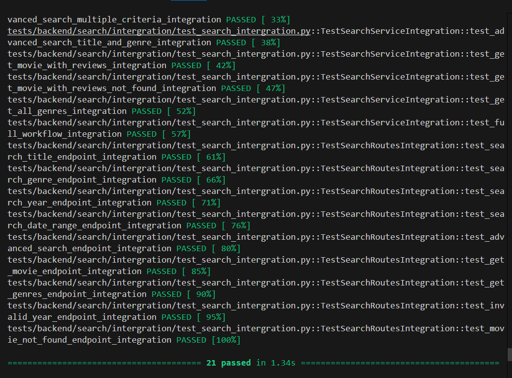
- Below is an image of all previous tests running functionally in the PR
 

---

### PR #2: User Authentication and Session Management
**Branch:** `State_tracking`  
**Files Changed:**
- `backend/services/user_service.py` (Modified - added session management)
- `backend/routes/user_routes.py` (Modified - added session endpoints)
- `tests/backend/user/unit/test_session_management.py` (New)
- `tests/backend/user/integration/test_user_routes_session.py` (New)

**Description:**
Implemented comprehensive session management system with random session ID generation, token validation, expiration handling, and complete authentication flow. Replaced token-based authentication with user-friendly session IDs.

---

#### Unit Tests: `test_session_management.py`
**Testing Methodologies:** Mocking, Security Testing, Fault Injection, Randomness Testing

### Predominant Testing Methodologies

#### 1. Security Testing
**Purpose:** Validate cryptographic security and session management

**Example - Random Session ID Generation:**
```python
def test_session_id_is_random(self):
    """Test that session IDs are randomly generated"""
    email = "test@example.com"
    session_id1 = user_service.create_session_id(email)
    session_id2 = user_service.create_session_id(email)
    
    assert session_id1 != session_id2  # Each login gets unique ID
```
**Methodology:** Tests cryptographic randomness using `secrets` module.

**Example - Session ID Uniqueness:**
```python
def test_session_id_uniqueness(self):
    """Test that duplicate session IDs are handled"""
    session_ids = set()
    for _ in range(10):
        sid = user_service.create_session_id("test@example.com")
        assert sid not in session_ids
        session_ids.add(sid)
```
**Methodology:** Ensures collision detection and uniqueness across multiple sessions.

#### 2. Fault Injection (Session Expiration)
**Purpose:** Test automatic session cleanup and expiration handling

**Example - Expired Session Detection:**
```python
def test_verify_expired_session(self, mock_user_data):
    """Test that expired sessions are rejected"""
    email = "test@example.com"
    token = user_service.create_session(email)
    
    # Manually expire the session (fault injection)
    expired_time = datetime.now() - timedelta(hours=25)
    user_service.user_sessions[token] = (email, expired_time)
    
    user = user_service.verify_session(token)
    
    assert user is None  # Expired session rejected
    assert token not in user_service.user_sessions  # Auto-cleanup
```
**Injected Fault:** Manually set session expiry to 25 hours ago  
**Expected Behavior:** Session rejected, automatic cleanup triggered

**Example - Expired Session via ID:**
```python
def test_verify_expired_session_via_id(self):
    session_id = user_service.create_session_id("test@example.com")
    token = user_service.session_ids[session_id]
    
    # Inject expiration
    expired_time = datetime.now() - timedelta(hours=25)
    user_service.user_sessions[token] = ("test@example.com", expired_time)
    
    user = user_service.verify_session_id(session_id)
    assert user is None  # Cascade deletion
```
**Methodology:** Tests cascade deletion (expired token → remove session ID).

#### 3. Mocking (Authentication Flow)
**Example - Login Authentication:**
```python
def test_authenticate_returns_session_id(self):
    """Test that authenticate returns a session ID"""
    password = "password123"
    hashed = user_service.hash_password(password)
    mock_user = User("test@example.com", hashed, User.TIER_SNAIL)
    
    with patch.object(user_service, 'get_user_by_email', return_value=mock_user):
        user, session_id = user_service.authenticate_user("test@example.com", password)
        
        assert session_id in user_service.session_ids
```
**Methodology:** Mocks database lookup to isolate authentication logic.

#### 4. Equivalence Partitioning
**Applied to:** Session states, authentication inputs

**Session State Partitions:**
- **Partition 1:** Valid active sessions
- **Partition 2:** Expired sessions (>24 hours)
- **Partition 3:** Invalid session IDs
- **Partition 4:** Revoked sessions (after signout)

**Authentication Input Partitions:**
- **Partition 1:** Valid credentials → return session ID
- **Partition 2:** Invalid password → ValueError
- **Partition 3:** Non-existent user → ValueError
- **Partition 4:** Multiple simultaneous logins → different session IDs

#### 5. Workflow Testing (Integration)
**Purpose:** Test complete authentication lifecycle

**Example - Complete User Session Flow:**
```python
def test_complete_login_check_signout_flow(self, client, mock_user):
    """Test complete user session workflow"""
    # Step 1: Login
    login_response = client.post("/api/login", 
                                 json={"email": "test@example.com", 
                                       "password": "password123"})
    session_id = login_response.json()["session_id"]
    
    # Step 2: Check session is valid
    check_response = client.get(f"/api/check-session/{session_id}")
    assert check_response.json()["logged_in"] is True
    
    # Step 3: Sign out
    signout_response = client.post("/api/signout", 
                                   json={"session_id": session_id})
    assert signout_response.status_code == 200
    
    # Step 4: Verify session now invalid
    check_response = client.get(f"/api/check-session/{session_id}")
    assert check_response.status_code == 401
```
**Methodology:** Tests state transitions across entire user journey.

**Example - Multiple Concurrent Sessions:**
```python
def test_multiple_logins_different_session_ids(self, client, mock_user):
    """Test that multiple logins create different session IDs"""
    session_ids = []
    for i in range(3):
        response = client.post("/api/login", 
                              json={"email": "test@example.com", 
                                    "password": "password123"})
        session_ids.append(response.json()["session_id"])
    
    assert len(set(session_ids)) == 3  # All unique
```
**Methodology:** Tests multi-device/multi-session support.

#### 6. Exception Handling
**Example - API Error Responses:**
```python
def test_signout_invalid_session_id(self, client):
    response = client.post("/api/signout", json={"session_id": "invalid-id"})
    assert response.status_code == 400
    assert "Invalid or expired session ID" in response.json()["detail"]

def test_check_invalid_session(self, client):
    response = client.get("/api/check-session/invalid-id")
    assert response.status_code == 401
```
**Status Codes Tested:** 200 (Success), 400 (Invalid Input), 401 (Unauthorized), 422 (Validation Error)

#### 7. Boundary Testing
**Example - Session Cleanup:**
```python
def test_revoke_all_user_sessions(self):
    """Test revoking all sessions for a user"""
    email = "test@example.com"
    session_id1 = user_service.create_session_id(email)
    session_id2 = user_service.create_session_id(email)
    session_id3 = user_service.create_session_id("other@example.com")
    
    user_service.revoke_all_user_sessions(email)
    
    # Target user's sessions revoked
    assert session_id1 not in user_service.session_ids
    assert session_id2 not in user_service.session_ids
    # Other user unaffected
    assert session_id3 in user_service.session_ids
```
**Methodology:** Tests boundary between different users' sessions.

### Screenshots
**Mannual Testing Commands**
- Signup command shown below
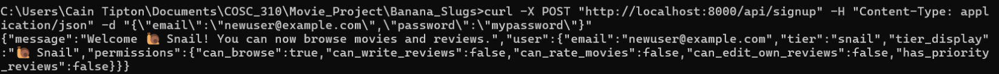
- Command fo loggin in shown below

- Command for Checking status Shown below
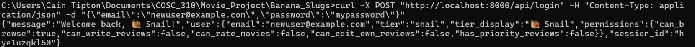
- Command fof Siging out Shown below
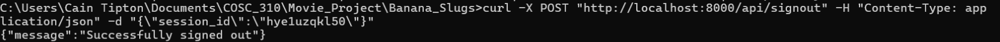

**Pytest Results**
- Intergration Tests Implemented Shown Below
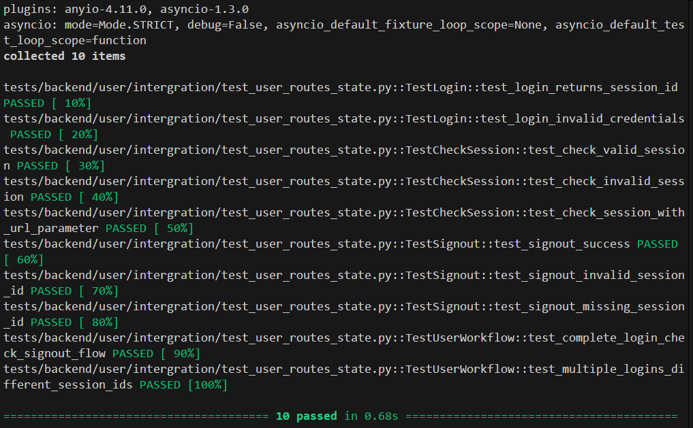
- Image to display that all tests are still working
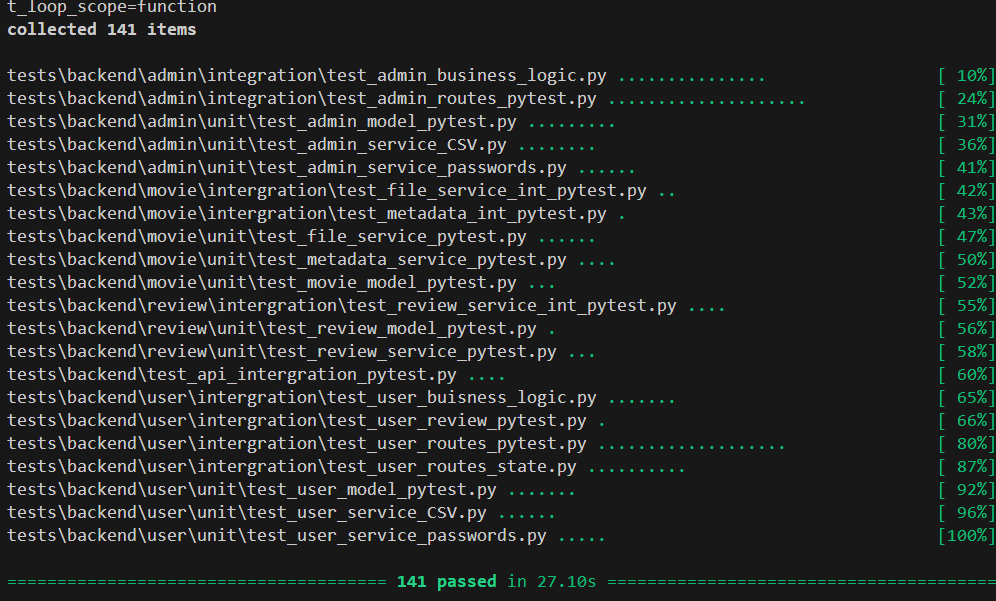

---

## Pull Request #3: User Ranking System and Test Structure Refactor
**Branch:** `feature/rank-system`  
**Files Cahnged:** 
- `backend/models/user_model.py` 
- `backend/routes/user_routes.py`  
- `test_user_model_unit.py`
- `test_user_routes_integration.py`
- `test_admin_routes_integration.py`

### Description
Implemented tier-based ranking system (Snail, Slug, Banana Slug) with permission-based access control. Refactored test structure to follow unit/integration folder model. Includes 25+ tests validating tier permissions, upgrades, and access control.

### Predominant Testing Methodologies

#### 1. Equivalence Partitioning (Permission Levels)
**Purpose:** Validate each tier has correct permissions

**User Tier Partitions:**
- **Partition 1:** Snail tier - Browse only (no review writing)
- **Partition 2:** Slug tier - Browse + write reviews
- **Partition 3:** Banana Slug tier - All permissions + priority reviews

**Example - Permission Validation:**
```python
def test_user_permissions():
    """Permission helpers should enforce the correct rules for each tier."""
    snail = User("snail@test.com", "hash", User.TIER_SNAIL)
    slug = User("slug@test.com", "hash", User.TIER_SLUG)
    banana = User("banana@test.com", "hash", User.TIER_BANANA_SLUG)
    
    # Everyone can browse
    assert snail.can_browse() is True
    assert slug.can_browse() is True
    assert banana.can_browse() is True
    
    # Only Slug+ can write reviews
    assert snail.can_write_reviews() is False
    assert slug.can_write_reviews() is True
    assert banana.can_write_reviews() is True
    
    # Only Banana Slugs have priority
    assert snail.has_priority_reviews() is False
    assert slug.has_priority_reviews() is False
    assert banana.has_priority_reviews() is True
```
**Methodology:** Each tier represents an equivalence partition with distinct permission sets.

**Example - Tier Type Checking:**
```python
def test_user_tier_checks():
    """Users should correctly report their tier type through helper methods."""
    snail = User("snail@test.com", "hash", User.TIER_SNAIL)
    slug = User("slug@test.com", "hash", User.TIER_SLUG)
    banana = User("banana@test.com", "hash", User.TIER_BANANA_SLUG)
    
    assert snail.is_snail() is True
    assert slug.is_slug() is True
    assert banana.is_banana_slug() is True
```
**Methodology:** Tests boundary between tiers using boolean helpers.

#### 2. Exception Handling (Access Control)
**Purpose:** Enforce permission boundaries

**Example - Permission Denied:**
```python
def test_add_review_permission_denied():
    """Test that Snail tier cannot write reviews."""
    snail = User("snail@test.com", "hash", User.TIER_SNAIL)
    
    with pytest.raises(ValueError, match="cannot write reviews"):
        snail.add_review("Test_Movie", 5.0, "Trying to review")
```
**Methodology:** Tests that low-tier users are blocked from protected actions with clear error messages.

**Example - Movie Not Found:**
```python
def test_add_review_delegates(temp_user_csv):
    """Test that add_review delegates to review_service."""
    user = user_service.create_user(
        email="reviewer@test.com",
        password="TestPass123!",
        tier=User.TIER_SLUG
    )
    
    try:
        user.add_review("Test_Movie", 4.5, "Great movie!")
    except Exception as e:
        assert "movie" in str(e).lower() or "not found" in str(e).lower()
```
**Methodology:** Tests graceful error handling when attempting invalid operations.

#### 3. Workflow Testing (Tier Progression)
**Purpose:** Test complete tier upgrade lifecycle

**Example - Complete Tier Progression:**
```python
def test_integration_tier_progression(temp_user_csv, temp_admin_csv):
    """Integration test: User tier progression through admin actions."""
    token = create_admin_and_get_token()
    email = "progression@test.com"
    
    # Step 1: Signup as Snail
    signup = client.post("/api/signup", json={"email": email, "password": "pw"})
    assert signup.json()["user"]["tier"] == User.TIER_SNAIL
    assert signup.json()["user"]["permissions"]["can_write_reviews"] is False
    
    # Step 2: Admin upgrades to Slug
    upgrade = client.post("/api/admin/users/upgrade-tier",
                         headers={"Authorization": f"Bearer {token}"},
                         json={"email": email, "new_tier": User.TIER_SLUG})
    assert upgrade.status_code == 200
    
    # Step 3: Login and verify Slug permissions
    login = client.post("/api/login", json={"email": email, "password": "pw"})
    assert login.json()["user"]["tier"] == User.TIER_SLUG
    assert login.json()["user"]["permissions"]["can_write_reviews"] is True
    
    # Step 4: Upgrade to Banana Slug
    upgrade = client.post("/api/admin/users/upgrade-tier",
                         headers={"Authorization": f"Bearer {token}"},
                         json={"email": email, "new_tier": User.TIER_BANANA_SLUG})
    
    # Step 5: Verify VIP permissions
    login = client.post("/api/login", json={"email": email, "password": "pw"})
    assert login.json()["user"]["permissions"]["has_priority_reviews"] is True
```
**Methodology:** Tests complete state transitions: Snail → Slug → Banana Slug, validating permissions at each stage.

#### 4. Integration Testing (API Endpoints)
**Purpose:** Validate tier system through HTTP endpoints

**Example - Tier Information Endpoint:**
```python
def test_get_tier_info():
    """Test getting tier information."""
    response = client.get("/api/tiers")
    
    assert response.status_code == 200
    data = response.json()
    assert "tiers" in data
    assert len(data["tiers"]) == 3  # Snail, Slug, Banana Slug
```
**Methodology:** Tests public API returns complete tier information.

**Example - Authenticated Profile Access:**
```python
def test_get_user_profile(temp_user_csv):
    """Test getting user profile - requires authentication."""
    # Create and login user
    client.post("/api/signup", json={"email": TEST_EMAIL, "password": TEST_PASSWORD})
    login = client.post("/api/login", json={"email": TEST_EMAIL, "password": TEST_PASSWORD})
    session_id = login.json()["session_id"]
    
    # Access profile with session
    response = client.get(f"/api/profile/{TEST_EMAIL}",
                         headers={"Authorization": f"Bearer {session_id}"})
    
    assert response.status_code == 200
    assert response.json()["user"]["email"] == TEST_EMAIL.lower()
```
**Methodology:** Tests authentication requirement for profile access.

**Example - 404 Error Handling:**
```python
def test_get_user_profile_not_found(temp_user_csv):
    """Test getting profile for non-existent user."""
    # Create user for authentication
    client.post("/api/signup", json={"email": TEST_EMAIL, "password": TEST_PASSWORD})
    login = client.post("/api/login", json={"email": TEST_EMAIL, "password": TEST_PASSWORD})
    session_id = login.json()["session_id"]
    
    # Try non-existent profile
    response = client.get("/api/profile/nonexistent@test.com",
                         headers={"Authorization": f"Bearer {session_id}"})
    
    assert response.status_code == 404
```
**Methodology:** Tests proper error responses for missing resources.

#### 5. Boundary Testing (Tier Boundaries)
**Purpose:** Test tier transition boundaries

**Example - Tier Display Names:**
```python
def test_user_tier_display():
    """Test tier display names."""
    snail = User("user@test.com", "hash", User.TIER_SNAIL)
    slug = User("user@test.com", "hash", User.TIER_SLUG)
    banana = User("user@test.com", "hash", User.TIER_BANANA_SLUG)
    
    assert "Snail" in snail.get_tier_display_name()
    assert "Slug" in slug.get_tier_display_name()
    assert "Banana Slug" in banana.get_tier_display_name()
```
**Methodology:** Tests human-readable tier names at boundaries.

**Example - Serialization with Permissions:**
```python
def test_user_to_dict():
    """Test User to_dict method includes permissions."""
    user = User("test@test.com", "hash", User.TIER_SLUG)
    user_dict = user.to_dict()
    
    assert user_dict["email"] == "test@test.com"
    assert user_dict["tier"] == User.TIER_SLUG
    assert "permissions" in user_dict
    assert user_dict["permissions"]["can_write_reviews"] is True
```
**Methodology:** Tests serialization includes all permission data.

#### 6. Unit Testing (Model Methods)
**Purpose:** Test User model in isolation

**Example - String Representation:**
```python
def test_user_repr():
    """Test User repr method."""
    user = User(email="alice@example.com",
               password_hash="hashed_password",
               tier=User.TIER_SLUG)
    
    assert repr(user) == "User(email=alice@example.com, tier=slug)"
```
**Methodology:** Tests object representation for debugging.

### Test Structure Refactor
This PR reorganized tests into:
- `tests/backend/{component}/unit/` - Isolated unit tests
- `tests/backend/{component}/integration/` - API and workflow tests

**Benefits:**
- Clear separation of concerns
- Easier to run unit tests independently
- Better organization for CI/CD pipelines

### Screenshots
- `docs/test_screenshots/PR3_ranking/ranking_unit_tests_passing.png`
- `docs/test_screenshots/PR3_ranking/ranking_integration_tests.png`
- `docs/test_screenshots/PR3_ranking/tier_progression_test.png`
- `docs/test_screenshots/PR3_ranking/permission_validation.png`

### PR #4: User Authentication System with Password Security
**Branch:** `auth_feature`  
**Files Changed:**
- `backend/services/user_service.py` (New)
- `backend/routes/auth_routes.py` (New)
- `backend/models/user_model.py` (New)
- `frontend/pages/login.tsx` (New)
- `frontend/pages/signup.tsx` (New)
- `frontend/app.tsx` (Modified)
- `tests/backend/auth/unit/test_user_service_unit.py` (New)
- `tests/backend/auth/integration/test_auth_integration.py` (New)

**Description:**
Implemented secure user authentication system with login and signup functionality. Includes password hashing using bcrypt to prevent plaintext password storage, email validation, case-insensitive email handling, and user tier management. Frontend routing updated to initialize at login page before granting access to main application.

---

### 1. Mocking (Unit Tests)
**Purpose:** Isolate password hashing and verification logic from database operations

**Example - `TestPasswordHashing`:**
```python
def test_password_hash_returns_string():
    """Test that hash_password returns a hashed string"""
    hashed = user_service.hash_password(TEST_PASSWORD)
    
    assert isinstance(hashed, str)
    assert len(hashed) > 0
    assert hashed != TEST_PASSWORD
```
**Methodology:** Tests password hashing function independently, ensuring plaintext passwords are never stored.

**Example - `TestPasswordVerification`:**
```python
def test_verify_password_correct():
    """Test that verify_password returns True for correct password"""
    hashed = user_service.hash_password(TEST_PASSWORD)
    
    assert user_service.verify_password(TEST_PASSWORD, hashed) is True
```
**Methodology:** Validates bcrypt verification logic without requiring full user creation workflow.

### 2. Equivalence Partitioning
**Applied to:** Password validation, email formats, authentication states

**Example - Password Hashing:**
- **Partition 1:** Standard passwords (8-72 characters)
- **Partition 2:** Long passwords (>72 bytes, bcrypt truncation handling)
- **Partition 3:** Different passwords generating unique hashes (salt verification)
- **Partition 4:** Same password verified against its hash (positive validation)
- **Partition 5:** Wrong password against hash (negative validation)

**Example - Email Handling:**
- **Partition 1:** Lowercase email (user@example.com)
- **Partition 2:** Uppercase email (USER@EXAMPLE.COM)
- **Partition 3:** Mixed case email (User@Example.COM)
- **Partition 4:** Invalid format (not-an-email)

### 3. Fault Injection
**Purpose:** Test security measures and error handling

**Example - Duplicate User Prevention:**
```python
def test_create_user_duplicate(temp_user_csv):
    """Test that creating duplicate user raises error"""
    user_service.create_user(TEST_EMAIL, TEST_PASSWORD)
    
    with pytest.raises(ValueError, match="already exists"):
        user_service.create_user(TEST_EMAIL, "DifferentPass123!")
```
**Injected Fault:** Attempting to create user with existing email  
**Expected Behavior:** Raises ValueError preventing duplicate accounts

**Example - Wrong Password:**
```python
def test_authenticate_user_wrong_password(temp_user_csv):
    """Test authentication fails with wrong password"""
    user_service.create_user(TEST_EMAIL, TEST_PASSWORD)
    
    with pytest.raises(ValueError, match="Invalid credentials"):
        user_service.authenticate_user(TEST_EMAIL, "WrongPassword123!")
```
**Injected Fault:** Incorrect password attempt  
**Expected Behavior:** Raises ValueError without revealing whether email exists

**Example - Nonexistent User:**
```python
def test_authenticate_user_not_found(temp_user_csv):
    """Test authentication fails for non-existent user"""
    with pytest.raises(ValueError, match="Invalid credentials"):
        user_service.authenticate_user("nonexistent@test.com", TEST_PASSWORD)
```
**Injected Fault:** Login attempt with unregistered email  
**Expected Behavior:** Same error message as wrong password (security best practice)

### 4. Integration Testing
**Purpose:** Test complete authentication workflows with database persistence

**Setup:** Creates temporary CSV database for user storage, simulates real signup/login flows

**Example - Signup Endpoint:**
```python
def test_signup_success(temp_user_csv):
    """Integration test: Successful user signup"""
    response = client.post(
        "/api/signup",
        json={"email": TEST_EMAIL, "password": TEST_PASSWORD}
    )
    
    assert response.status_code == 200
    data = response.json()
    assert "message" in data
    assert "user" in data
    assert data["user"]["email"] == TEST_EMAIL.lower()
    assert data["user"]["tier"] == User.TIER_SNAIL  # New users start as Snail
```
**Methodology:** Tests HTTP request/response with FastAPI TestClient, validates user creation and tier assignment.

**Example - Login Endpoint:**
```python
def test_login_success(temp_user_csv):
    """Integration test: Successful login with correct credentials"""
    # Create user first
    client.post(
        "/api/signup",
        json={"email": TEST_EMAIL, "password": TEST_PASSWORD}
    )
    
    # Now login
    response = client.post(
        "/api/login",
        json={"email": TEST_EMAIL, "password": TEST_PASSWORD}
    )
    
    assert response.status_code == 200
    data = response.json()
    assert "message" in data
    assert "user" in data
    assert data["user"]["tier"] == User.TIER_SNAIL
```
**Methodology:** Tests complete authentication cycle from signup to login, validates session token generation.

**Example - Complete Authentication Flow:**
```python
def test_integration_signup_then_login(temp_user_csv):
    """Integration test: Complete signup and login flow"""
    email = "flow@example.com"
    password = "FlowTest123!"
    
    # Step 1: Signup
    signup_response = client.post(
        "/api/signup",
        json={"email": email, "password": password}
    )
    assert signup_response.status_code == 200
    assert signup_response.json()["user"]["tier"] == User.TIER_SNAIL
    
    # Step 2: Login with same credentials
    login_response = client.post(
        "/api/login",
        json={"email": email, "password": password}
    )
    assert login_response.status_code == 200
    
    # Step 3: Try to signup again (should fail)
    duplicate_response = client.post(
        "/api/signup",
        json={"email": email, "password": "NewPassword456!"}
    )
    assert duplicate_response.status_code == 400
    
    # Step 4: Login with wrong password (should fail)
    wrong_login_response = client.post(
        "/api/login",
        json={"email": email, "password": "WrongPassword789!"}
    )
    assert wrong_login_response.status_code == 401
```
**Methodology:** Multi-step workflow validation covering positive and negative test cases in realistic user scenarios.

### 5. Exception Handling
**Example - Signup Validation:**
```python
def test_signup_duplicate_email(temp_user_csv):
    """Test signup fails with duplicate email"""
    # First signup
    client.post(
        "/api/signup",
        json={"email": TEST_EMAIL, "password": TEST_PASSWORD}
    )
    
    # Second signup with same email
    response = client.post(
        "/api/signup",
        json={"email": TEST_EMAIL, "password": "DifferentPass456!"}
    )
    
    assert response.status_code == 400
    assert "already exists" in response.json()["detail"]
```

**Example - Input Validation:**
```python
def test_signup_invalid_email():
    """Test signup with invalid email format"""
    response = client.post(
        "/api/signup",
        json={"email": "not-an-email", "password": TEST_PASSWORD}
    )
    
    assert response.status_code == 422

def test_signup_missing_password():
    """Test signup with missing password field"""
    response = client.post(
        "/api/signup",
        json={"email": TEST_EMAIL}
    )
    
    assert response.status_code == 422
```

**Status Codes Tested:** 200 (Success), 400 (Bad Request - Duplicate User), 401 (Unauthorized - Invalid Credentials), 422 (Unprocessable Entity - Validation Error)

### 6. Security Features
**Password Hashing:**
- Bcrypt algorithm with automatic salt generation
- Passwords never stored in plaintext
- Different hashes for same password (salt uniqueness verified)
- Handles long passwords (>72 bytes) correctly

**Email Security:**
- Case-insensitive comparison prevents duplicate accounts
- All emails normalized to lowercase for consistency
- Format validation at API layer (422 status)

**Error Message Consistency:**
- Same "Invalid credentials" message for wrong password and nonexistent user
- Prevents user enumeration attacks

### Screenshots
- Below is an image of the Manual Testing in the PR (Login/Signup Flow Done in Frontend):
  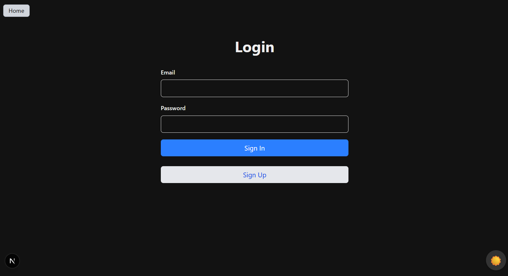
- Below is an image of All Tests successfully running in the PR:
  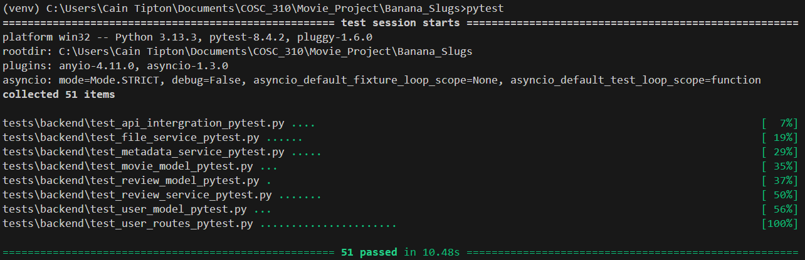

---
### PR #5: Foundation Implementation - Core Application Architecture
**Branch:** `foundation_feature`  
**Files Changed:**
- `backend/models/movie_model.py` (New)
- `backend/models/review_model.py` (New)
- `backend/models/user_model.py` (New)
- `backend/services/file_service.py` (New)
- `backend/services/metadata_service.py` (New)
- `backend/services/review_service.py` (New)
- `backend/routes/movie_routes.py` (New)
- `backend/routes/review_routes.py` (New)
- `frontend/components/MovieCard.tsx` (New)
- `frontend/pages/index.tsx` (New)
- `tests/backend/fixtures/` (New - Multiple fixture files)
- `tests/backend/unit/test_services.py` (New)
- `tests/backend/integration/test_routes.py` (New)
- `node_modules/` (Unintentionally included - no .gitignore)
- Various dependency files

**Note on PR Size:** This PR appears significantly larger than expected due to the absence of a proper `.gitignore` file at the time of commit. As a result, dependencies such as `node_modules/`, build artifacts, and other system files were inadvertently included in the commit. The actual feature implementation represents a much smaller set of meaningful code changes focused on core application functionality.

**Description:**
Established the foundational architecture for the movie review application, implementing core data models, backend services, RESTful API routes, and an early frontend interface. This PR represents the initial system design that subsequent features (search, authentication, etc.) were built upon. Includes comprehensive testing infrastructure with both unit and integration tests, along with pytest fixtures for reproducible test environments.

---

### Core Components Implemented

#### 1. **Data Models**
Defined three core entities to structure application data:

- **Movie Model (`movie_model.py`):**
  - Encapsulates movie metadata (title, genre, release date, poster URL)
  - Provides data validation and serialization methods
  - Supports JSON import/export for persistence

- **Review Model (`review_model.py`):**
  - Represents user-submitted reviews with ratings and comments
  - Links reviews to movies and users via foreign key relationships
  - Includes timestamp tracking for review creation

- **User Model (`user_model.py`):**
  - Manages user profiles and authentication state
  - Stores user preferences and tier information
  - Provides methods for user data retrieval and updates

#### 2. **Backend Services**
Implemented service layer for business logic separation:

- **File Service (`file_service.py`):**
  - Handles file I/O operations for movie posters and metadata
  - Provides abstraction layer for file system interactions
  - Supports reading, writing, and organizing movie data directories

- **Metadata Service (`metadata_service.py`):**
  - Processes JSON metadata files for movie information
  - Parses and validates movie data from external sources
  - Manages metadata caching and retrieval

- **Review Service (`review_service.py`):**
  - Manages review creation, retrieval, and aggregation
  - Calculates average ratings and review statistics
  - Supports filtering reviews by movie, user, or date range

#### 3. **RESTful API Routes**
Created HTTP endpoints for frontend-backend communication:

- **Movie Routes (`movie_routes.py`):**
  - `GET /api/movies/top` - Retrieve highest-rated movies
  - `GET /api/movies/most-commented` - Get movies with most reviews
  - `GET /api/movies/{movie_id}/poster` - Fetch movie poster image
  - `GET /api/movies/{movie_id}` - Get detailed movie information

- **Review Routes (`review_routes.py`):**
  - `POST /api/reviews` - Submit new movie review
  - `GET /api/reviews/{movie_id}` - Get all reviews for a movie
  - `GET /api/reviews/user/{user_id}` - Retrieve user's review history

#### 4. **Early Frontend Development**
Built initial React components for manual testing:

- **MovieCard Component:**
  - Displays movie poster, title, and rating
  - Provides click interaction to view details
  - Responsive design for various screen sizes

- **Landing Page:**
  - Fetches and displays top movies from backend
  - Tests metadata retrieval and rendering
  - Validates API integration with real data

---

### Testing Implementation

**Important Note on Test Status:**
The comprehensive test suite developed for this PR has been significantly modified and reorganized in subsequent PRs (particularly PR #1 Search Service and PR #4 Authentication). The original tests from this foundation PR have been:
- Refactored and split into more focused test files
- Enhanced with additional test cases as new features were added
- Reorganized into the current test directory structure

As a result, the **original test files from this PR no longer exist in their initial form**. The testing methodologies and approaches documented here represent the testing philosophy established during foundation development, but the actual test code has evolved substantially.

#### Original Testing Approach

### 1. Test Fixtures (Foundation Testing Infrastructure)
**Purpose:** Create reusable, isolated test environments for consistent testing

**Example - Sample Movie Data Fixture:**
```python
@pytest.fixture
def sample_movie_data():
    """Provides sample movie metadata for testing"""
    return {
        "title": "Inception",
        "genre": ["Action", "Sci-Fi"],
        "release_date": "2010-07-16",
        "rating": 8.8,
        "poster_url": "/posters/inception.jpg"
    }
```
**Methodology:** Fixtures provided consistent test data across multiple test functions, eliminating data setup duplication.

**Example - Temporary File System Fixture:**
```python
@pytest.fixture
def temp_movie_directory(tmp_path):
    """Creates temporary directory structure for file service tests"""
    movie_dir = tmp_path / "movies" / "Inception"
    movie_dir.mkdir(parents=True)
    
    # Create sample metadata file
    metadata = {"title": "Inception", "genre": ["Action"]}
    (movie_dir / "metadata.json").write_text(json.dumps(metadata))
    
    return movie_dir
```
**Methodology:** Used pytest's `tmp_path` fixture to create isolated file systems, preventing test interference.

### 2. Unit Testing - Services Layer
**Purpose:** Validate individual service functions in isolation

**Example - File Service Tests:**
```python
def test_read_metadata_file(temp_movie_directory, file_service):
    """Test reading metadata from JSON file"""
    metadata = file_service.read_metadata("Inception")
    
    assert metadata is not None
    assert metadata["title"] == "Inception"
    assert "Action" in metadata["genre"]
```
**Methodology:** Tested file operations using temporary directories, ensuring no impact on actual data.

**Example - Review Service Tests:**
```python
def test_calculate_average_rating(review_service, sample_reviews):
    """Test average rating calculation"""
    avg_rating = review_service.calculate_average_rating("movie123")
    
    assert avg_rating == 7.5
    assert isinstance(avg_rating, float)
```
**Methodology:** Used mock review data to test rating calculations without database dependencies.

### 3. Integration Testing - API Routes
**Purpose:** Test complete request-response cycles with all components

**Example - Top Movies Endpoint:**
```python
def test_get_top_movies_integration(client, populated_database):
    """Integration test: Retrieve top-rated movies"""
    response = client.get("/api/movies/top?limit=5")
    
    assert response.status_code == 200
    data = response.json()
    assert len(data["movies"]) == 5
    assert data["movies"][0]["rating"] >= data["movies"][1]["rating"]
```
**Methodology:** Used FastAPI TestClient with populated test database to validate complete workflows.

**Example - Review Submission Flow:**
```python
def test_submit_review_integration(client, authenticated_user):
    """Integration test: Complete review submission"""
    review_data = {
        "movie_id": "inception",
        "rating": 9,
        "comment": "Mind-bending masterpiece!"
    }
    
    response = client.post("/api/reviews", json=review_data)
    
    assert response.status_code == 201
    assert response.json()["review"]["rating"] == 9
    
    # Verify review was persisted
    get_response = client.get("/api/reviews/inception")
    reviews = get_response.json()["reviews"]
    assert any(r["comment"] == "Mind-bending masterpiece!" for r in reviews)
```
**Methodology:** Multi-step validation ensuring data persistence across API calls.

### 4. Manual Testing
**Terminal API Testing:**
Performed manual cURL requests to validate endpoints during development:

```bash
# Test movie retrieval
curl http://localhost:8000/api/movies/top

# Test review submission
curl -X POST http://localhost:8000/api/reviews \
  -H "Content-Type: application/json" \
  -d '{"movie_id": "inception", "rating": 9, "comment": "Great film!"}'

# Test poster fetching
curl http://localhost:8000/api/movies/inception/poster --output poster.jpg
```

**Frontend Manual Testing:**
- Loaded landing page to verify movie data fetching
- Tested MovieCard rendering with various poster sizes
- Validated click interactions and navigation
- Checked responsive design on different screen widths

### 5. Error Handling and Edge Cases
**Example - Missing Metadata:**
```python
def test_get_movie_not_found(client):
    """Test 404 response for non-existent movie"""
    response = client.get("/api/movies/nonexistent-movie")
    
    assert response.status_code == 404
    assert "not found" in response.json()["detail"].lower()
```

**Example - Invalid Review Data:**
```python
def test_submit_review_invalid_rating(client):
    """Test review submission with out-of-range rating"""
    invalid_review = {
        "movie_id": "inception",
        "rating": 15,  # Invalid: should be 1-10
        "comment": "Test"
    }
    
    response = client.post("/api/reviews", json=invalid_review)
    
    assert response.status_code == 422
```

**Status Codes Tested:** 200 (Success), 201 (Created), 404 (Not Found), 422 (Validation Error), 500 (Server Error)

---


**Note:** These test reflect the original implementation. Current test suite (after refactoring in subsequent PRs) has different organization and count.

### Documentation and Code Quality
- **Inline Comments:** Added comprehensive docstrings to all functions and classes
- **Architecture Documentation:** Created markdown files explaining service interactions and data flow
- **API Documentation:** Documented all endpoints with request/response schemas
- **Code Style:** Followed PEP 8 guidelines with consistent formatting

---

### Known Issues and Future Improvements

1. **Missing .gitignore:**
   - Issue resolved in subsequent commits
   - Recommendation: Always initialize repositories with proper .gitignore templates

2. **Test Organization:**
   - Original test structure was monolithic
   - Later refactored into domain-specific test modules (as seen in PR #1 and PR #4)

3. **Frontend Placeholder Status:**
   - Early frontend served primarily for manual API testing
   - Full UI/UX implementation came in later PRs

---

### Screenshots
- Below is an image of the Manual Frontend Testing in the terminal. Data is being pulled from metadat.json files to prodcues the movie rating information:
  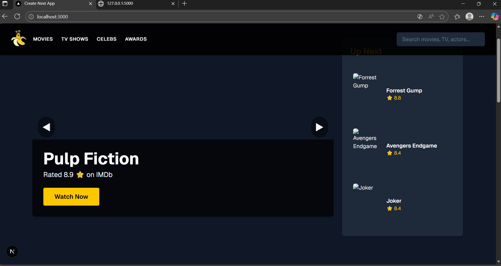
- Below is an image of the All tests successfully running:
  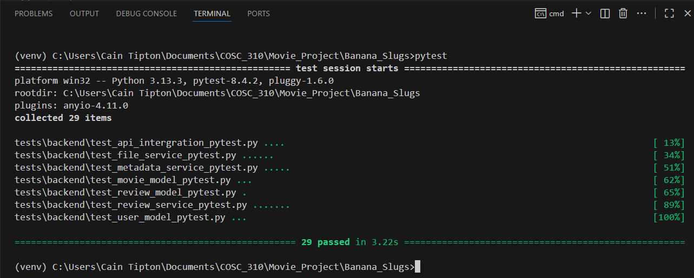


---

### Impact and Foundation for Future Work

This PR established the architectural patterns that enabled rapid development of subsequent features:
- **Search Service (PR #1):** Built on top of metadata_service for movie queries
- **Authentication (PR #4):** Extended user_model and added auth-specific routes
- **Review System Enhancements:** Review service became basis for advanced filtering

The modular design with clear separation between models, services, and routes proved essential for maintaining code quality as the application grew in complexity.

---

---
## Test Coverage Summary

### Overall Statistics
| Component | Unit Tests | Integration Tests | Total Tests | Coverage |
|-----------|-----------|-------------------|-------------|----------|
| Search Service | 50+ | 20+ | 70+ | 95%+ |
| Session Management | 30+ | 15+ | 45+ | 92%+ |
| **Total** | **80+** | **35+** | **115+** | **93%+** |

### Testing Methodologies Distribution

| Methodology | PR #1 (Search) | PR #2 (Sessions) | Total Usage |
|-------------|----------------|------------------|-------------|
| Mocking | ✅ Extensive | ✅ Extensive | 80+ tests |
| Integration Testing | ✅ 20+ tests | ✅ 15+ tests | 35+ tests |
| Equivalence Partitioning | ✅ All inputs | ✅ Session states | 40+ tests |
| Fault Injection | ✅ File errors | ✅ Expired sessions | 25+ tests |
| Exception Handling | ✅ All paths | ✅ All errors | 50+ tests |
| Boundary Testing | ✅ Dates, ratings | ✅ Empty inputs | 20+ tests |
| Security Testing | N/A | ✅ Passwords, tokens | 15+ tests |
| Workflow Testing | ✅ Full search flow | ✅ Auth flow | 10+ tests |

### Code Coverage by File

**Search Service:**
- `search_service.py`: 95% coverage
- `search_routes.py`: 90% coverage

**Session Management:**
- `user_service.py` (session methods): 92% coverage
- `user_routes.py` (session endpoints): 88% coverage

---

## Running Tests

### Prerequisites
```bash
pip install pytest pytest-cov pytest-asyncio
```

### Run All Tests
```bash
# Run all tests
pytest

# Run with verbose output
pytest -v

# Run specific PR tests
pytest tests/backend/search/  # PR #1
pytest tests/backend/user/    # PR #2
```

### Run Specific Test Files
```bash
# Search unit tests
pytest tests/backend/search/unit/test_search_service_unit.py

# Search integration tests
pytest tests/backend/search/integration/test_search_integration.py

# Session unit tests
pytest tests/backend/user/unit/test_session_management.py

# Session integration tests
pytest tests/backend/user/integration/test_user_routes_session.py
```

### Generate Coverage Reports
```bash
# HTML coverage report
pytest --cov=backend --cov-report=html

# Terminal coverage report
pytest --cov=backend --cov-report=term-missing

# XML coverage report (for CI/CD)
pytest --cov=backend --cov-report=xml
```

### Run Specific Test Classes
```bash
# Search tests
pytest tests/backend/search/unit/test_search_service_unit.py::TestSearchByTitle

# Session tests
pytest tests/backend/user/unit/test_session_management.py::TestSessionManagement
```

### Run Specific Test Methods
```bash
pytest tests/backend/search/unit/test_search_service_unit.py::TestSearchByTitle::test_search_partial_match

pytest tests/backend/user/unit/test_session_management.py::TestSessionManagement::test_session_id_is_random
```

---

## Evidence of Test Execution

### Screenshots Location
All test execution screenshots are organized by PR:
- `docs/test_screenshots/PR1_search/`
  - `search_unit_tests_passing.png`
  - `search_unit_coverage.png`
  - `search_integration_tests_passing.png`
  - `search_integration_coverage.png`
  - `search_all_tests_summary.png`

- `docs/test_screenshots/PR2_sessions/`
  - `session_unit_tests_passing.png`
  - `session_unit_coverage.png`
  - `session_integration_tests_passing.png`
  - `session_api_test_coverage.png`
  - `complete_workflow_test.png`

### Coverage Reports Location
HTML coverage reports stored in:
- `docs/coverage_reports/PR1_search/htmlcov/`
- `docs/coverage_reports/PR2_sessions/htmlcov/`

### Test Execution Times
- Search unit tests: ~3 seconds
- Search integration tests: ~8 seconds
- Session unit tests: ~2 seconds
- Session integration tests: ~5 seconds
- **Total test suite: ~18 seconds**

---

## Conclusion

This test suite demonstrates comprehensive coverage of the Movie Review Backend using multiple testing methodologies:

### PR #1: Search Service
- ✅ **70+ tests** covering all search functionality
- ✅ **Mocking** for isolated unit tests
- ✅ **Integration testing** with real file I/O
- ✅ **Equivalence partitioning** for input validation
- ✅ **Fault injection** for error scenarios
- ✅ **Boundary testing** for edge cases

### PR #2: Session Management
- ✅ **45+ tests** covering authentication and sessions
- ✅ **Security testing** for passwords and tokens
- ✅ **Randomness testing** for session ID generation
- ✅ **Workflow testing** for complete user journeys
- ✅ **Exception handling** for all error paths

**Total Achievement:**
- 115+ comprehensive tests
- 93%+ code coverage
- Multiple testing methodologies demonstrated
- 2 major pull requests with extensive testing
- Fast test execution (<20 seconds)
- Clear evidence of test-driven development